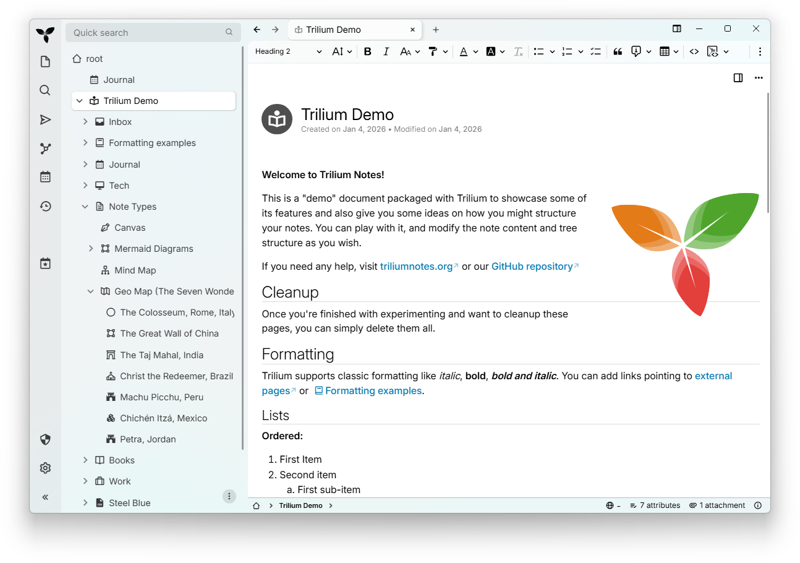

<div align="center">
	<sup>Special thanks to:</sup><br />
	<a href="https://go.warp.dev/Trilium" target="_blank">		
		<br />
		Warp, built for coding with multiple AI agents<br />
	</a>
  <sup>Available for macOS, Linux and Windows</sup>
</div>

<hr />

# Trilium Notes


\

\
[](https://app.relative-ci.com/projects/Di5q7dz9daNDZ9UXi0Bp)
[](https://hosted.weblate.org/engage/trilium/)

<!-- translate:off -->
<!-- LANGUAGE SWITCHER -->
[Chinese (Simplified Han script)](./README-ZH_CN.md) | [Chinese (Traditional Han
script)](./README-ZH_TW.md) | [English](../README.md) | [French](./README-fr.md)
| [German](./README-de.md) | [Greek](./README-el.md) | [Italian](./README-it.md)
| [Japanese](./README-ja.md) | [Romanian](./README-ro.md) |
[Spanish](./README-es.md)
<!-- translate:on -->

Trilium Notes بولسا ھەقسىز، ئوچۇق كودلۇق، سىستېما ھالقىغان، قاتلاملىق خاتىرە
قالدۇرۇش ئەپى بولۇپ، ئۇ ئاساسلىقى چوڭ تىپتىكى شەخسىي بىلىم ئامبىرى قۇرۇشقا
ئەھمىيەت بېرىدۇ.



## چۈشۈرۈش⏬
- [ئەڭ يېڭى نۇسخىسى](https://github.com/TriliumNext/Trilium/releases/latest) –
  مۇقىم نۇسخا، كۆپ ساندىكى ئابونتلارنىڭ ئىشلىتىشى تەۋسىيە قىلىنىدۇ.
- [كۈندىلىك
  قۇرۇلما](https://github.com/TriliumNext/Trilium/releases/tag/nightly) – مۇقىم
  بولمىغان ئېچىش نۇسخىسى، ھەر كۈنى يېڭىلىنىدۇ، ئەڭ يېڭى ئىقتىدارلار ۋە
  تۈزىتىشلەرنى ئۆز ئىچىگە ئالىدۇ.

## ھۆججەتلەر📚

بىزنىڭ تولۇق قوللانمىمىزنى كۆرۈڭ:
[docs.triliumnotes.org](https://docs.triliumnotes.org/)

بىزنىڭ قوللانمىمىزنىڭ بىر قانچە خىل شەكىلدىكى نۇسخىلىرى بار:
- **تور قوللانمىسى**：بىزنىڭ تولۇق قوللانمىمىزنى مۇشۇ شەكىلدە كۆرۈڭ:
  [docs.triliumnotes.org](https://docs.triliumnotes.org/)
- **پروگرامما ئىچىدىكى ياردەم**: Trilium دا` F1` نى باسسىڭىزلا، پروگرامما ئىچىدە
  ئوخشاش بىر قوللانمىنى بىۋاسىتە كۆرەلەيسىز
- **GitHub**：بۇ ئامباردىكى [ئابونت قوللانمىسىنى](./User%20Guide/User%20Guide/)
  كۆرۈڭ

### تېز ئۇلانمىلار
- [ئابونت چۈشەندۈرۈشى](https://docs.triliumnotes.org/)
- [قاچىلاش چۈشەندۈرۈشى](https://docs.triliumnotes.org/user-guide/setup)
- [Docker
  تەڭشەكلىرى](https://docs.triliumnotes.org/user-guide/setup/server/installation/docker)
- [TriliumNext نى دەرىجىسىنى
  ئۆستۈرۈش](https://docs.triliumnotes.org/user-guide/setup/upgrading)
- [ئاساسىي ئۇقۇملار ۋە
  ئالاھىدىلىكلەر](https://docs.triliumnotes.org/user-guide/concepts/notes)
- [شەخسىي بىلىم ئامبىرى
  ئەندىزىسى](https://docs.triliumnotes.org/user-guide/misc/patterns-of-personal-knowledge)

## 🎁 ئىقتىدارلار

* خاتىرىلەرنى ھەر قانداق چوڭقۇرلۇقتىكى دەرەخسىمان قۇرۇلمىغا تەشكىللەشكە بولىدۇ.
  بىرلا خاتىرىنى دەرەخنىڭ كۆپلىگەن ئورنىغا قويۇشقا بولىدۇ ([خاتىرىنى
  كۆپەيتىش/كلونلاش](https://docs.triliumnotes.org/user-guide/concepts/notes/cloning)
  غا قاراڭ)
* تۆت تەرەپتىن كۆرۈنىدىغان (WYSIWYG) بېيىتىلغان خاتىرە تەھرىرلىگۈچ، جەدۋەل،
  رەسىم ۋە [ماتېماتىكىلىق
  فورمۇلا](https://docs.triliumnotes.org/user-guide/note-types/text)نى قوللايدۇ،
  ھەمدە Markdown نىڭ [ئاپتوماتىك
  فورماتى](https://docs.triliumnotes.org/user-guide/note-types/text/markdown-formatting)غا
  ئىگە
* [پروگرامما كودى
  خاتىرىسى](https://docs.triliumnotes.org/user-guide/note-types/code)نى
  تەھرىرلەشنى قوللايدۇ، كود نۇرىنى ئۆز ئىچىگە ئالىدۇ
* خاتىرىلەر ئارىسىدا تېز ۋە ئوڭاي
  [يېتەكلەش](https://docs.triliumnotes.org/user-guide/concepts/navigation/note-navigation)،
  پۈتۈن تېكىستلىك ئىزدەش، ھەمدە [خاتىرىگە فوكۇسلىنىش
  (hoisting)](https://docs.triliumnotes.org/user-guide/concepts/navigation/note-hoisting)
* ئۈزۈلۈپ قالمايدىغان [خاتىرە نۇسخىسىنى
  باشقۇرۇش](https://docs.triliumnotes.org/user-guide/concepts/notes/note-revisions)
* خاتىرە
  [خاسلىقى](https://docs.triliumnotes.org/user-guide/advanced-usage/attributes)
  خاتىرىلەرنى تەشكىللەش، سۈرۈشتۈرۈش ۋە يۇقىرى دەرىجىلىك
  [script](https://docs.triliumnotes.org/user-guide/scripts)لەرگە ئىشلىتىلىدۇ
* UI ئىنگلىزچە، گېرمانچە، ئىسپانچە، فىرانسۇزچە، رۇمىنىيەچە ۋە خەنزۇچە تىللىرىدا
  تەمىنلىنىدۇ
* تېخىمۇ بىخەتەر كىرىش ئۈچۈن [OpenID ۋە
  TOTP](https://docs.triliumnotes.org/user-guide/setup/server/mfa) بىۋاسىتە بىر
  گەۋدىلەشتۈرۈلگەن
* ئۆزى قۇرغان ماسقەدەملەش مۇلازىمىتىرى بىلەن
  [ماسقەدەملەش](https://docs.triliumnotes.org/user-guide/setup/synchronization)
  * [ماسقەدەملەش مۇلازىمىتىرىنى ئورۇنلاشتۇرۇش ئۈچۈن ئۈچىنچى تەرەپ
    مۇلازىمىتى](https://docs.triliumnotes.org/user-guide/setup/server/cloud-hosting)
    بار
* خاتىرىنى ئىنتېرنېت تورىغا
  [ھەمبەھرىلەش](https://docs.triliumnotes.org/user-guide/advanced-usage/sharing)
  (ئاشكارە ئېلان قىلىش
* ھەر بىر خاتىرە بىرلىك قىلىنغان كۈچلۈك [خاتىرە
  شىفىرلاش](https://docs.triliumnotes.org/user-guide/concepts/notes/protected-notes)
* قولدا سىزىلغان/ئىزاھلىق رەسىم: [Excalidraw](https://excalidraw.com/) غا
  ئاساسلانغان (خاتىرە تىپى «canvas»）
* خاتىرە ۋە ئۇلارنىڭ مۇناسىۋىتىنى كۆرسىتىپ بېرىدىغان [مۇناسىۋەت
  خەرىتىسى](https://docs.triliumnotes.org/user-guide/note-types/relation-map) ۋە
  [خاتىرە/ئۇلانما
  خەرىتىسى](https://docs.triliumnotes.org/user-guide/note-types/note-map)
* تەپەككۇر خەرىتىسى: [Mind Elixir](https://docs.mind-elixir.com/) غا ئاساسلانغان
* ئورۇن بەلگىلەش بەلگىسى ۋە GPX يۆنىلىش لىنىيىسى بولغان [جۇغراپىيىلىك
  خەرىتە](https://docs.triliumnotes.org/user-guide/collections/geomap)
* [Script](https://docs.triliumnotes.org/user-guide/scripts) - [ئىلغار
  كۆرسىتىش](https://docs.triliumnotes.org/user-guide/advanced-usage/advanced-showcases)گە
  قاراڭ
* ئاپتوماتلاشتۇرۇش ئۈچۈن ئىشلىتىلىدىغان [REST
  API](https://docs.triliumnotes.org/user-guide/advanced-usage/etapi)
* ئىشلىتىشچانلىقى ۋە ئۈنۈمى جەھەتتە ياخشى كېڭىيىشچانلىققا ئىگە، 100,000 دىن
  ئارتۇق خاتىرىنى قوللايدۇ
* يانفون ۋە تاختا كومپيۇتېر ئۈچۈن ئەلالاشتۇرۇلغان [كۆچمە
  تەرەپ](https://docs.triliumnotes.org/user-guide/setup/mobile-frontend)
* ئىچىگە ئورۇنلاشتۇرۇلغان [قېنىق رەڭلىك
  تېما](https://docs.triliumnotes.org/user-guide/concepts/themes)
* [Evernote دىن
  ئەكىرىش](https://docs.triliumnotes.org/user-guide/concepts/import-export/evernote)
  ۋە [Markdown نى ئەكىرىش ھەم
  چىقىرىش](https://docs.triliumnotes.org/user-guide/concepts/import-export/markdown)
* توردىكى مەزمۇنلارنى تېز ساقلاشقا ئىشلىتىلىدىغان [Web
  Clipper](https://docs.triliumnotes.org/user-guide/setup/web-clipper)
* ئىختىيارىي تەڭشىگىلى بولىدىغان UI (يان تىزىملىك كۇنۇپكىلىرى، ئىشلەتكۈچى ئۆزى
  بەلگىلىگەن كىچىك قوراللار قاتارلىقلار)
* [Metrics ](https://docs.triliumnotes.org/user-guide/advanced-usage/metrics)،
  شۇنداقلا Grafana كۆرسىتىش تاختىسى.

✨ تېخىمۇ كۆپ TriliumNext تېمىلىرى، قوليازما، قىستۇرما ۋە مەنبەلەرگە ئېرىشمەكچى
بولسىڭىز، تۆۋەندىكى ئۈچىنچى تەرەپ مەنبەلىرى ياكى جەمئىيەتلىرىدىن پايدىلانسىڭىز
بولىدۇ:

- [awesome-trilium](https://github.com/Nriver/awesome-trilium) (ئۈچىنچى تەرەپ
  تېمىلىرى، قوليازمىلار، قىستۇرمىلار ۋە باشقىلار).
- [TriliumRocks!](https://trilium.rocks/) (دەرسلىكلەر، يېتەكچىلەر ۋە باشقىلار).

## ⚠️ نېمە ئۈچۈن TriliumNext نى تاللايمىز؟

Trilium نىڭ ئەسلى ئىجادچىسى ([Zadam](https://github.com/zadam)) سېخىيلىق بىلەن
Trilium كود ئامبىرىنى جەمئىيەت تۈرىگە ئۆتكۈزۈپ بەردى، بۇ تۈر ھازىر مۇشۇ ئادرېستا
ساقلىنىۋاتىدۇ: https://github.com/TriliumNext

### ⬆️ Trilium دىن كۆچۈرۈش؟

zadam/Trilium نۇسخىسىدىن TriliumNext/Notes غا كۆچۈش ئۈچۈن ئالاھىدە كۆچۈرۈش
باسقۇچلىرى كېرەك ئەمەس. [TriliumNext/Notes نى ئادەتتىكى ئۇسۇلدا
قاچىلىسىڭىزلا](#-installation)(#-install)، ئۇ بىۋاسىتە ھازىرقى ساندانىڭىزنى
ئىشلىتىدۇ.

[v0.90.4](https://github.com/TriliumNext/Trilium/releases/tag/v0.90.4) غىچە
بولغان نەشرلىرى zadam/trilium نىڭ ئەڭ يېڭى
[v0.63.7](https://github.com/zadam/trilium/releases/tag/v0.63.7) نەشرى بىلەن
ماسلىشىدۇ. ئۇنىڭدىن كېيىنكى TriliumNext نەشرلىرىدە ماسقەدەملەش نەشر نومۇرى
ئۆستۈرۈلگەن بولۇپ، يۇقىرىقىلار بىلەن ماسلاشمايدۇ.

## 💬 بىز بىلەن پىكىر ئالماشتۇرۇڭ

رەسمىي جەمئىيىتىمىزگە كەلگەنلىكىڭىزنى قارشى ئالىمىز. بىز سىزنىڭ ئىقتىدار، تەكلىپ
ياكى مەسىلىلەر ھەققىدىكى پىكىرلىرىڭىزنى ئاڭلاشنى ئارزۇ قىلىمىز!

- [Matrix](https://matrix.to/#/#triliumnext:matrix.org) (ماسقەدەملىك مۇنازىرە)
  - `General `Matrix ئۆيىمۇ [XMPP](xmpp:discuss@trilium.thisgreat.party?join) غا
    ئۇلانغان
- [GitHub Discussions](https://github.com/TriliumNext/Trilium/discussions)
  (ئاسىنكرون مۇنازىرە).
- [Github Issues](https://github.com/TriliumNext/Trilium/issues) (For bug
  reports and feature requests.)

## 🏗 Installation

### Windows / MacOS

Download the binary release for your platform from the [latest release
page](https://github.com/TriliumNext/Trilium/releases/latest), unzip the package
and run the `trilium` executable.

### Linux

If your distribution is listed in the table below, use your distribution's
package.

[](https://repology.org/project/triliumnext/versions)

You may also download the binary release for your platform from the [latest
release page](https://github.com/TriliumNext/Trilium/releases/latest), unzip the
package and run the `trilium` executable.

TriliumNext is also provided as a Flatpak, but not yet published on FlatHub.

### Browser (any OS)

If you use a server installation (see below), you can directly access the web
interface (which is almost identical to the desktop app).

Currently only the latest versions of Chrome & Firefox are supported (and
tested).

### Mobile

To use TriliumNext on a mobile device, you can use a mobile web browser to
access the mobile interface of a server installation (see below).

See issue https://github.com/TriliumNext/Trilium/issues/4962 for more
information on mobile app support.

If you prefer a native Android app, you can use
[TriliumDroid](https://apt.izzysoft.de/fdroid/index/apk/eu.fliegendewurst.triliumdroid).
Report bugs and missing features at [their
repository](https://github.com/FliegendeWurst/TriliumDroid). Note: It is best to
disable automatic updates on your server installation (see below) when using
TriliumDroid since the sync version must match between Trilium and TriliumDroid.

### Server

To install TriliumNext on your own server (including via Docker from
[Dockerhub](https://hub.docker.com/r/triliumnext/trilium)) follow [the server
installation docs](https://docs.triliumnotes.org/user-guide/setup/server).


## 💻 Contribute

### Translations

If you are a native speaker, help us translate Trilium by heading over to our
[Weblate page](https://hosted.weblate.org/engage/trilium/).

Here's the language coverage we have so far:

[](https://hosted.weblate.org/engage/trilium/)

### Code

Download the repository, install dependencies using `pnpm` and then run the
server (available at http://localhost:8080):
```shell
git clone https://github.com/TriliumNext/Trilium.git
cd Trilium
pnpm install
pnpm run server:start
```

### Documentation

Download the repository, install dependencies using `pnpm` and then run the
environment required to edit the documentation:
```shell
git clone https://github.com/TriliumNext/Trilium.git
cd Trilium
pnpm install
pnpm edit-docs:edit-docs
```

### Building the Executable
Download the repository, install dependencies using `pnpm` and then build the
desktop app for Windows:
```shell
git clone https://github.com/TriliumNext/Trilium.git
cd Trilium
pnpm install
pnpm run --filter desktop electron-forge:make --arch=x64 --platform=win32
```

For more details, see the [development
docs](https://github.com/TriliumNext/Trilium/tree/main/docs/Developer%20Guide/Developer%20Guide).

### Developer Documentation

Please view the [documentation
guide](https://github.com/TriliumNext/Trilium/blob/main/docs/Developer%20Guide/Developer%20Guide/Environment%20Setup.md)
for details. If you have more questions, feel free to reach out via the links
described in the "Discuss with us" section above.

## 👏 Shoutouts

* [zadam](https://github.com/zadam) for the original concept and implementation
  of the application.
* [Sarah Hussein](https://github.com/Sarah-Hussein) for designing the
  application icon.
* [nriver](https://github.com/nriver) for his work on internationalization.
* [Thomas Frei](https://github.com/thfrei) for his original work on the Canvas.
* [antoniotejada](https://github.com/nriver) for the original syntax highlight
  widget.
* [Dosu](https://dosu.dev/) for providing us with the automated responses to
  GitHub issues and discussions.
* [Tabler Icons](https://tabler.io/icons) for the system tray icons.

Trilium would not be possible without the technologies behind it:

* [CKEditor 5](https://github.com/ckeditor/ckeditor5) - the visual editor behind
  text notes. We are grateful for being offered a set of the premium features.
* [CodeMirror](https://github.com/codemirror/CodeMirror) - code editor with
  support for huge amount of languages.
* [Excalidraw](https://github.com/excalidraw/excalidraw) - the infinite
  whiteboard used in Canvas notes.
* [Mind Elixir](https://github.com/SSShooter/mind-elixir-core) - providing the
  mind map functionality.
* [Leaflet](https://github.com/Leaflet/Leaflet) - for rendering geographical
  maps.
* [Tabulator](https://github.com/olifolkerd/tabulator) - for the interactive
  table used in collections.
* [FancyTree](https://github.com/mar10/fancytree) - feature-rich tree library
  without real competition.
* [jsPlumb](https://github.com/jsplumb/jsplumb) - visual connectivity library.
  Used in [relation
  maps](https://docs.triliumnotes.org/user-guide/note-types/relation-map) and
  [link
  maps](https://docs.triliumnotes.org/user-guide/advanced-usage/note-map#link-map)

## 🤝 Support

Trilium is built and maintained with [hundreds of hours of
work](https://github.com/TriliumNext/Trilium/graphs/commit-activity). Your
support keeps it open-source, improves features, and covers costs such as
hosting.

Consider supporting the main developer
([eliandoran](https://github.com/eliandoran)) of the application via:

- [GitHub Sponsors](https://github.com/sponsors/eliandoran)
- [PayPal](https://paypal.me/eliandoran)
- [Buy Me a Coffee](https://buymeacoffee.com/eliandoran)

## 🔑 License

Copyright 2017-2025 zadam, Elian Doran, and other contributors

This program is free software: you can redistribute it and/or modify it under
the terms of the GNU Affero General Public License as published by the Free
Software Foundation, either version 3 of the License, or (at your option) any
later version.
