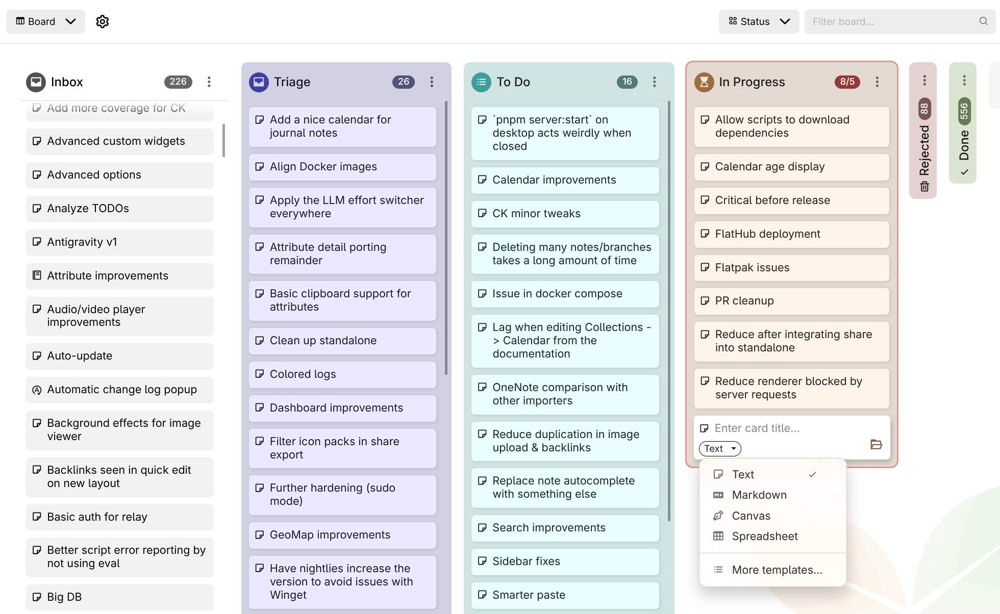
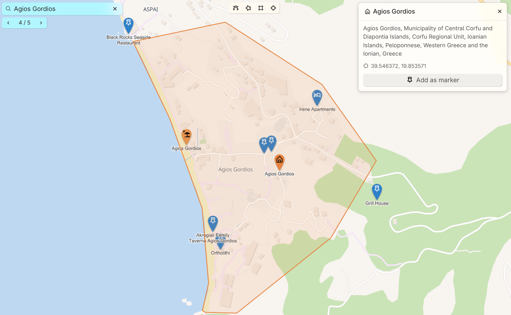

# v0.106.0
> [!NOTE]
> If you enjoyed this release, consider showing a token of appreciation by:
> 
> *   Pressing the “Star” button on [GitHub](https://github.com/TriliumNext/Trilium) (top-right).
> *   Considering a one-time or recurrent donation to the [lead developer](https://github.com/eliandoran) via [GitHub Sponsors](https://github.com/sponsors/eliandoran) or [PayPal](https://paypal.me/eliandoran).

> [!TIP]
> For Linux users: Trilium is now available on [Flathub](https://flathub.org/en/apps/org.triliumnotes.Trilium)!

## 💡 Key highlights

<figure class="image image-style-align-right image_resized" style="width:60.75%;"></figure>

### 📋 Kanban board overhaul by @adoriandoran

The board has been rebuilt to handle real projects. Give each column an icon, a color or a card limit, collapse the columns you're not working on, and archive them once they're done. New notes that don't belong to a column yet land in an optional **Inbox** column. Cards can be created from a template (e.g. a _Bug_ template for a bug tracker), and **Board properties** controls which attributes the cards show and in what order. You can also switch the attribute the board is grouped by at any time, and each grouping keeps its own columns.

As a board grows, sort columns automatically by title, date or any attribute, and narrow the board with the filter box in the header, which accepts the full search syntax. Select several cards with <kbd>Ctrl</kbd>/<kbd>Shift</kbd>+click to move, edit or delete them together. Use **Copy reference** to link to a card or column from any note. The whole board works from the keyboard (<kbd>Alt</kbd>+<kbd>F1</kbd> lists the shortcuts) and by touch on mobile, and a column with thousands of cards now stays smooth.

This concludes the phase two of the board collection, more features to come.

### 🔎 Significant improvements to search

1.  **Matching by @perfectra1n**
    1.  Punctuation-aware exact matching: `=sync` finds `(sync)`, `sync,`, `"sync"` (#10616)
    2.  Fuzzy tolerance now scales with term length (0/1/2 edits); a substring is no longer treated as a typo
    3.  `~*` matches fragments again; fuzzy fallback extended to note body content
    4.  Link previews and reference-link target titles are indexed and searchable
    5.  Diacritics normalized for highlighting too, not just matching
    6.  **Ranking:** results ordered by match quality (exact phrase > proximity > word > prefix > substring > fuzzy), bounded so content never outranks a title match.
2.  **Results view by @perfectra1n**
    1.  Google-style snippet cards with breadcrumb and matched-attribute badges (#5667, #6225)
    2.  Always-visible result count + synced 10/20/50/100 page-size option
    3.  Fuzzy matches highlighted distinctly (dotted orange) from exact ones; `%=` regex terms highlight correctly (#5332)
3.  **Jump to match by @perfectra1n:** clicking a result opens the note at the first match with the find bar pre-filled; collapsed sections expand automatically (#3098, #10616). Jump to Note stays a title-only navigator (no misleading content snippet).
4.  Improved the speed of the jump-to-note significantly by optimizing the search itself, but also by honoring the option to disable fuzzy search in autocompletion (which was disabled by default but not used at all).

### 🗺️ Geomap now features a built-in location search, current position indicator and shapes

<figure class="image image_resized image-style-align-right" style="width:51.61%;"></figure>

The geo map has a new **search bar**. As you type, it finds the markers, tracks and shapes already on your map. To search the rest of the world, pick the row that offers it and it asks Nominatim; nothing is sent while you're still typing. Results are sorted by distance and favor what's on screen, so a shop searched from your own town finds the one down the road. Towns and areas show their outline, and any result can be kept with **Add as marker**. You can also paste coordinates to jump straight to a spot.

You can also **draw on the map** now: paths, areas, rectangles and circles. Each shape is a note, so it takes the note's color and icon and opens in the same panel as a marker. Places shown on the map itself, like shops or beaches, can be clicked and added as markers too. On a phone or tablet, the new **locate** button shows where you are, so it's easy to see what's nearby.

### 📰 Templates can now define a default parent for new notes

Add a `~template:newNoteDefaultParent` relation to a template note, pointing it at the note where its instances should live (e.g. a _Person_ template pointing at _People_). When you create a note from that template (via **Choose note type**, `@`\-completion, _Create and link child note_, or the attribute editor) and don't explicitly pick a location, the note lands under that default parent instead of your current note. Picking a path yourself always takes priority, and the tree's _Insert child note_ / _Insert note after_ remain unaffected.

### ✨️ And others…

*   LLM: Added support for Google Antigravity, which can be used with a free plan as well.
*   The application gains a proper loading screen instead of a plain white background until everything has loaded.
*   OCR now properly supports image (scanned) and vector-based PDFs.
*   [Sorting now supports multiple criteria](https://github.com/TriliumNext/Trilium/issues/6829) by @BeatLink & @eliandoran
*   Search (full search, quick search) now have syntax highlighting, autocompletion, @-note insertion. In addition, the search is checked for errors which are displayed in-line. Full searches are now multiline.
*   Icons (just like the note icons) can now be inserted in text notes.

## 🐞 Bugfixes

1.  [Sidebar buttons overlap with the tab buttons at small sizes](https://github.com/TriliumNext/Trilium/issues/11097)
2.  LLM
    1.  Claude Code / Copilot integration would sometimes not be able to find the binary, if it was installed through `npm` on macOS.
    2.  Error shown when interrupting a stream from Claude Code.
3.  [Markdown import would not preserve checkboxes when split by line breaks](https://github.com/TriliumNext/Trilium/issues/11129)
4.  [Startup-metrics.log file appearing in Home directory](https://github.com/TriliumNext/Trilium/issues/11165#issuecomment-5387721208)
5.  [macOS app icon renders as colored noise at small sizes](https://github.com/TriliumNext/Trilium/issues/11187)
6.  Notion import: [Creation date is not preserved for some notes despite being present in the HTML export](https://github.com/TriliumNext/Trilium/issues/11205)
7.  [Auto read-only mode renders note content with slightly different vertical spacing than edit mode](https://github.com/TriliumNext/Trilium/issues/11194)
8.  Sync from desktop fixes by @emxv
    
    1.  [Don't show loopback in the list of networks](https://github.com/TriliumNext/Trilium/pull/11262)
    2.  [Layout issues on mobile](https://github.com/TriliumNext/Trilium/pull/11263)
9.  [Automatic light/dark theme switching sometimes doesn't properly update on Linux](https://github.com/TriliumNext/Trilium/issues/11267)
10.  [`/assets/vX`  not working.](https://github.com/TriliumNext/Trilium/issues/8613)
11.  Search: [Tokenize ~= and ~\* as single fuzzy-match operators](https://github.com/TriliumNext/Trilium/pull/9508) by @mrbeandev
12.  [In-page search (Ctrl+F) does not find text inside inline, cards, and internal links](https://github.com/TriliumNext/Trilium/issues/11242) by @maphew
13.  [Formats and attributes disappear after switching note type to Markdown and back](https://github.com/TriliumNext/Trilium/issues/11367) by @jmrplens
14.  [Calendar is recreated when using "New note" launch bar item](https://github.com/TriliumNext/Trilium/issues/11034) (and through other note-creation mechanisms)
15.  [Search: commas in quoted text are improperly handled](https://github.com/TriliumNext/Trilium/issues/11132) by @yzxcj797
16.  [Base URL for custom LLM providers is incorrect](https://github.com/TriliumNext/Trilium/issues/11323)
17.  [Multiple icon picker windows appear](https://github.com/TriliumNext/Trilium/issues/11163) by @maphew
18.  [Child note preview readability degrades when the code note's theme (dark/light) differs from the global appearance theme](https://github.com/TriliumNext/Trilium/issues/11309)
19.  [Two collapse‑related enter‑key bugs for todo/unordered lists](https://github.com/TriliumNext/Trilium/issues/11256) by @maphew
20.  [Quick Search does not limit to hoisted hidden notes](https://github.com/TriliumNext/Trilium/issues/10803)
21.  [Search finds bookmarked notes in hidden tree](https://github.com/TriliumNext/Trilium/issues/10021)
22.  Sidebar on mobile doesn't account for splits.
23.  OIDC logout fails when end\_session\_endpoint is cross-origin due to XHR/CORS by @dajiaohuang
24.  Markdown active block indicator doesn't work properly for all block types (e.g. admonitions).
25.  [Pressing Ctrl+M when not editing a text note minimizes Trilium](https://github.com/TriliumNext/Trilium/issues/9753) by @maphew
26.  [Missing non-breaking space between reference link icon and text](https://github.com/TriliumNext/Trilium/issues/11459) by @maphew
27.  [Bookmarked note icons in the launch bar: “Open note in new tab” always adds a tab at the very end](https://github.com/TriliumNext/Trilium/issues/11458) by @maphew
28.  [Keyboard navigation in Promoted Attributes -- Relations are skipped](https://github.com/TriliumNext/Trilium/issues/11447) by @maphew
29.  [Typing quickly after Ctrl+L causes search text to be added to note](https://github.com/TriliumNext/Trilium/issues/7996) by @maphew
30.  Table collection: [Tab to next table view field in new record results in original field being focused](https://github.com/TriliumNext/Trilium/issues/6474)
31.  [Disappearing/reappearing checkboxes in collapsible block](https://github.com/TriliumNext/Trilium/issues/11544)
32.  [Multi-value label promoted attributes lack autocompletion](https://github.com/TriliumNext/Trilium/issues/11558)
33.  [Error with Mermaid ("The matrix is not invertible")](https://github.com/TriliumNext/Trilium/issues/11322)
34.  Dropdowns not closed when they become disabled by @maphew
35.  [noteId is not validated when forced, leading to broken note links](https://github.com/TriliumNext/Trilium/issues/8169) by @maphew
36.  [Some tooltip and context menu glitches](https://github.com/TriliumNext/Trilium/issues/10705) (partial) by @maphew
37.  [shareAlias links not clickable in shared notes](https://github.com/TriliumNext/Trilium/issues/8942) by @maphew
38.  [Attribute #shareExternalLink has no effect](https://github.com/TriliumNext/Trilium/issues/8448) by @maphew
39.  “English RTL” language would show up in the initial setup.
40.  [Table: # column doesn't auto-resize properly](https://github.com/TriliumNext/Trilium/issues/11590)
41.  [LLM: Keep the chat SSE stream alive across idle proxy timeouts](https://github.com/TriliumNext/Trilium/pull/11628) by @ltomazetto
42.  [\--start-hidden / "Start minimized to tray" does not hide window on startup (Linux, all configs)](https://github.com/TriliumNext/Trilium/issues/10808) by @maphew
43.  [Browser navigation not handling note navigation properly](https://github.com/TriliumNext/Trilium/pull/11545) by @maphew
44.  Deleted notes would appear as empty notes (no content, no title) after a heavy sync
45.  Right clicking some links would open the link instead of just displaying the context menu.
46.  [Windows reserved name handling didn't account for extensions](https://github.com/TriliumNext/Trilium/pull/11626) by @sxh313
47.  [Search doesn't support escaped characters such as &](https://github.com/TriliumNext/Trilium/pull/11625) by @shx313
48.  [Canvas: inserting images and exporting drawings failed on the desktop app](https://github.com/TriliumNext/Trilium/pull/11213) by @adoriandoran

## ✨ Improvements

1.  Markdown import/export: maintain collapsible attributes and preserve formatting as much as possible when converting to HTML and vice-versa.
2.  Geomap improvements:
    1.  New markers now follow `#titleTemplate`
    2.  GPX tracks have a dedicated icon and their name no longer carries the extension when imported.
    3.  Automatic light/dark mode for vector themes
3.  Docker healthcheck script has been improved to be faster and with less CPU usage. The health-check now reports the right status, even for self-signed certificates.
4.  Presentation collection has a few new themes.
5.  [Markdown: strip `<style>` tags from previews.](https://github.com/TriliumNext/Trilium/pull/11210)
6.  Desktop: Extra windows (e.g. opening a note in a new window) now open much faster.
7.  Share: show the matched content when displaying search results.
8.  [Note autocompletions (e.g. @-mentions) now also offer to create notes in the journal/inbox instead of as child notes.](https://github.com/TriliumNext/Trilium/issues/6817)
9.  [Highlight active title in the table of contents](https://github.com/TriliumNext/Trilium/pull/9727) by @SiriusXT and @eliandoran
10.  [Printing: use the note title instead of a generic “Trilium Notes”](https://github.com/TriliumNext/Trilium/issues/11140) by @yzxcj797 and @eliandoran
11.  [Scripts can now return multiple widgets](https://github.com/TriliumNext/Trilium/pull/11120) by @BeatLink
12.  [Keep the tree and the note in place when deleting a note](https://github.com/TriliumNext/Trilium/pull/11409) by @perfectra1n
13.  Improved code notes scroll performance
14.  [TOTP now enforces that a code can only be used once and it tolerates clock drift](https://github.com/TriliumNext/Trilium/pull/11448) by @jmrplens
15.  The text note context menu is now available for the web version too.
16.  [Show “Full search” at the bottom of quick search](https://github.com/TriliumNext/Trilium/pull/11473) by @BeatLink
17.  API log is now available on mobile as well.
18.  Slash command for upload image.
19.  [Quick search can now be navigated with the arrow keys](https://github.com/TriliumNext/Trilium/pull/11474) by @BeatLink and @eliandoran
20.  Drag & drop imports in the note tree now recognize Obsidian vaults
21.  Promoted attributes: relation with multiple values now have links to quickly navigate to the note.
22.  Disable virtual keyboard autocomplete in Code notes.
23.  Keyboard navigation for note type chooser by @itsjakobx and @eliandoran
24.  [macOS 26 tinted icons](https://github.com/TriliumNext/Trilium/pull/11487) by @anandghegde
25.  [Slash commands: add to-do list item](https://github.com/TriliumNext/Trilium/pull/11529) by @itsjakobx
26.  Reworked the Mermaid preview with better pan and zoom as well as keyboard interaction.
27.  Improved the performance of batch deleting notes, including a progress report.
28.  The sync button now shows a small bar to indicate the progress of the sync.
29.  LLM:
    1.  Detect GitHub Copilot shims and report them properly.
    2.  More efficient Claude Code and GitHub Copilot which reduces the time and memory consumption between conversations.
30.  Spreadsheets now print, export and share as they look in the editor, including links, rotated text and borders, by @adoriandoran
31.  Icons are now vertically aligned correctly across the app, including icon packs, by @adoriandoran
32.  Insert date/time now comes with multiple formats, accessible through the dropdown arrow and slash commands.
33.  ETAPI: Accept `utcDateModified` on `create-note` and note patch

## 🚨 Breaking Changes

*   `cheerio` has been dropped as a built-in library because it was not being used by the application itself, only by third-party scripts. See the documentation for how to migrate.
*   The server has been migrated to ESM, so the entry point has changed to `main.mjs` instead of `main.cjs`. If you are using the normal `trilium.sh` there is no impact, but if you are pointing directly at `main.cjs` you will need to change your configuration.
*   `#label=value` is now strict full-value equality, `#capital=Vienna` no longer matches `Vienna Austria` (#9422). Quick search keeps "contains".

## 🌍 Internationalization

## 📖 Documentation

## 🛠️ Technical updates

1.  Reduced the size on disk of Trilium by ~8 MB by cleaning up some dependencies and optimizing existing ones.
2.  The server and desktop apps have been migrated to ESM, which brings in reduced memory consumption and faster start-up.
3.  CI hardening by @Totara-thib
4.  Add alternate Trillium spelling for discovery by @maphew
5.  Align Linux window class with launcher by @dajiaohuang & @eliandoran
6.  Fixed some non-critical errors when first initializing the database.
7.  `SortableCard` and `dialog.pickSingleItem` are now available to frontend scripts by @adoriandoran
8.  support TRILIUM\_LAUNCH\_EXEC for unbundled Electron packages on Linux by @dajiaohuang

## 🔒️ Security fixes

1.  Hardened some share-related features such as include note, share aliases and icon packs.
2.  Hardened excerpts rendering.