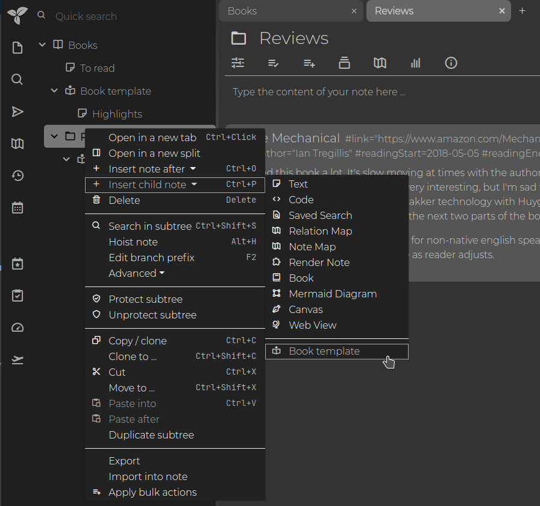

# Templates
A template in Trilium serves as a predefined structure for other notes, referred to as instance notes. Assigning a template to a note brings three main effects:

1.  **Attribute Inheritance**: All attributes from the template note are [inherited](Attributes/Attribute%20Inheritance.md) by the instance notes. Even attributes with `#isInheritable=false` are inherited by the instance notes, although only inheritable attributes are further inherited by the children of the instance notes.
2.  **Content Duplication**: The content of the template note is copied to the instance note, provided the instance note is empty at the time of template assignment.
3.  **Child Note Duplication**: All child notes of the template are deep-duplicated to the instance note.

## Example

A typical example would be a "Book" template note, which might include:

*   **Promoted Attributes**: Such as publication year, author, etc. (see [promoted attributes](Attributes/Promoted%20Attributes.md)).
*   **Outline**: An outline for a book review, including sections like themes, conclusion, etc.
*   **Child Notes**: Additional notes for highlights, summary, etc.

## Instance Note

An instance note is a note related to a template note. This relationship means the instance note's content is initialized from the template, and all attributes from the template are inherited.

To create an instance note through the UI:

For the template to appear in the menu, the template note must have the `#template` label. Do not confuse this with the `~template` relation, which links the instance note to the template note. If you use [workspaces](../Basic%20Concepts%20and%20Features/Navigation/Workspaces.md), you can also mark templates with `#workspaceTemplate` to display them only in the workspace.

Templates can also be added or changed after note creation by creating a `~template` relation pointing to the desired template note. 

To specify a template for child notes, you can use a `~child:template` relation pointing to the appropriate template note. There is no limit to the depth of the hierarchy — you can use `~child:child:template`, `~child:child:child:template`, and so on.

> [!IMPORTANT]
> Changing the template hierarchy after the parent note is created will not retroactively apply to newly created child notes.  
> For example, if you initially use `~child:template` and later switch to `~child:child:template`, it will not automatically apply the new template to the grandchild notes. Only the structure present at the time of note creation is considered.

## Regarding note types

By default, newly created notes are <a class="reference-link" href="../Note%20Types/Text.md">Text</a> notes. If a parent note defines a `child:template` pointing to a template of a different type (e.g. a Code note), the behavior depends on how the new note is created:

*   If no note type is explicitly chosen (e.g. the + button in the <a class="reference-link" href="../Basic%20Concepts%20and%20Features/UI%20Elements/Note%20Tree.md">Note Tree</a>), the template is applied and the new note takes the type and content of the template.
*   If a note type is explicitly selected (e.g. <a class="reference-link" href="../Basic%20Concepts%20and%20Features/UI%20Elements/Note%20Tree.md">Note Tree</a> → _Insert note after_ / _Insert child note_):
    *   If the selected type matches the template's type, the template is applied.
    *   If the selected type differs, the template is disregarded entirely — the new note is an empty note of the selected type.

Selecting a specific template from the creation menu always takes precedence over `child:template`.

## Additional Notes

From a visual perspective, templates can define `#iconClass` and `#cssClass` attributes, allowing all instance notes (e.g., books) to display a specific icon and CSS style.

Explore the concept further in the <a class="reference-link" href="Database/Demo%20Notes.md">Demo Notes</a>, including examples like the <a class="reference-link" href="../Note%20Types/Relation%20Map.md">Relation Map</a>, <a class="reference-link" href="Advanced%20Showcases/Task%20Manager.md">Task Manager</a>, and <a class="reference-link" href="Advanced%20Showcases/Day%20Notes.md">Day Notes</a>.

Additionally, see <a class="reference-link" href="Default%20Note%20Title.md">Default Note Title</a> for creating title templates. Note templates and title templates can be combined by creating a `#titleTemplate` for a template note.