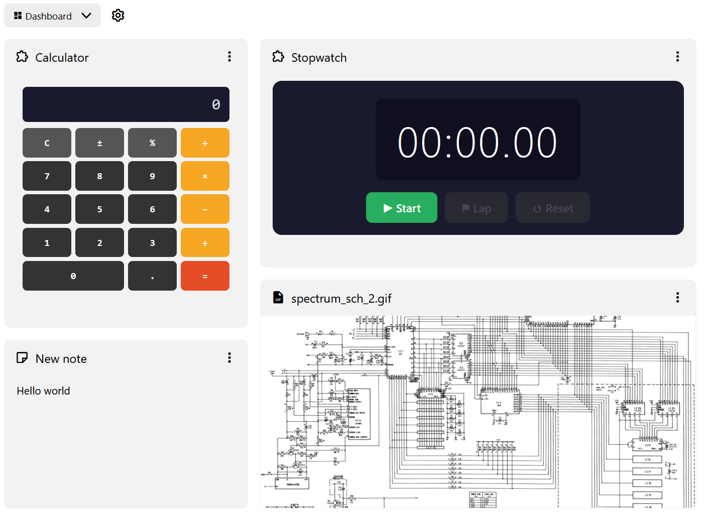

# Dashboard
<figure class="image"></figure>

> [!NOTE]
> The dashboard is currently considered beta. This means that it might face some changes in behavior until it is stabilized.

The dashboard is a collection introduced in Trilium v0.104.0. It is similar to the <a class="reference-link" href="Grid%20View.md">Grid View</a> collection, but with some key differences:

*   The grid layout is not fixed, allowing for tiles of varying widths and heights. The grid has 12 columns and an unlimited number of rows.
*   Each widget represents a child note of the collection and can be reordered or resized.
*   The grid will distribute the columns evenly to fill the entire screen.
    *   If the available space is too low (e.g. in a split or in mobile), the columns are collapsed so that all widgets are displayed one under the other.
    *   While the columns are collapsed, the widgets cannot be reordered or resized.
*   Unlike the <a class="reference-link" href="Grid%20View.md">Grid View</a>, the widgets are not clickable which allows them to be interactive.

## Types of widgets

The dashboard uses the same rendering mechanism as the <a class="reference-link" href="Grid%20View.md">Grid View</a> or the <a class="reference-link" href="../Basic%20Concepts%20and%20Features/Notes/Note%20List.md">Note List</a>, which means every note can be rendered, such as:

*   Static content, via <a class="reference-link" href="../Note%20Types/Text.md">Text</a> or <a class="reference-link" href="../Note%20Types/Code.md">Code</a>.
*   Images via <a class="reference-link" href="../Note%20Types/File.md">File</a>, <a class="reference-link" href="../Note%20Types/Mermaid%20Diagrams.md">Mermaid Diagrams</a>, <a class="reference-link" href="../Note%20Types/Mind%20Map.md">Mind Map</a>.
*   Interactive widgets via <a class="reference-link" href="../Note%20Types/Render%20Note.md">Render Note</a>.
*   Web pages can be displayed via <a class="reference-link" href="../Note%20Types/Web%20View.md">Web View</a> and refreshed via the context menu.
*   <a class="reference-link" href="../Collections.md">Collections</a> render interactively inside the dashboard

> [!TIP]
> Interactive widgets through the use of <a class="reference-link" href="../Note%20Types/Render%20Note.md">Render Note</a> is the highlighted use case of the dashboard. Using the <a class="reference-link" href="../AI.md">AI</a> chat, these widgets can be easily created as the AI is instructed in how to write them.

## Adding new widgets

There are two ways to add widgets to a dashboard:

*   Create a child note of any type, the dashboard will automatically pick it up and add it onto the grid.
*   From the <a class="reference-link" href="../Basic%20Concepts%20and%20Features/UI%20Elements/Note%20Tree.md">Note Tree</a>, drag an existing note onto the dashboard and it will be placed there. This will [clone](../Basic%20Concepts%20and%20Features/Notes/Cloning%20Notes.md) the note into the collection.