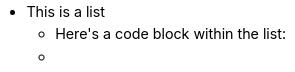
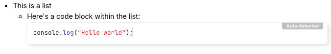
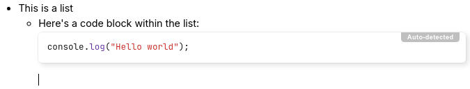

# Lists
There are three types of lists supported by text notes:

*    Bulleted lists (also known as unordered lists).
*    Numbered lists (or ordered lists).
*    To-do lists

For bulleted and numbered lists, it's possible to configure an alternative marker such as squares or Roman numbering by pressing the  icon. For numbered lists, it's also possible to specify the number to start at or whether to count in reverse order.

## Keyboard interaction

*   To create a new list:
    *   Bulleted list: Start a line with `*` or `-` followed by a space;
    *   Numbered list: Start a line with `1.` or `1)` followed by a space;
    *   To-do list: Start a line with `- [ ]` for an unchecked item or `[x]` for a checked item.
*   To create a new item in the list, press <kbd>Enter</kbd>.
*   To create a blank line within a list item, press <kbd>Shift</kbd>+<kbd>Enter</kbd>.
*   To exit out of the list, press <kbd>Enter</kbd> twice.
*   To merge two lists, simply delete the gap between them.
*   To create nested lists, simply use the  button (see _Indentation_ in <a class="reference-link" href="Other%20features.md">Other features</a>) or the <kbd>Tab</kbd> key. To decrease the nesting level for the current element, press <kbd>Shift</kbd>+<kbd>Tab</kbd>.

## Headings, code blocks within lists

It possible to add content-level blocks such as headings, code blocks, tables within lists, as follows:

|  |  |  |
| --- | --- | --- |
| 1 |  | First, create a list. |
| 2 |  | Press Enter to create a new list item. |
| 3 |  | Press Backspace to get rid of the bullet point. Notice the cursor position. |
| 4 |  | At this point, insert any desired block-level item such as a code block. |
| 5 |  | To continue with a new bullet point, press Enter until the cursor moves to a new blank position. |
| 6 |  | Press Enter once more to create the new bullet. |

The same principle applies to all three list types (bullet, numbered and to-do).

## To-do lists

*   To insert a to-do list from the keyboard, type `- [ ]` for an unchecked item or `[x]` for a checked item while on an empty paragraph.
*   To reorder the item under the cursor, press <kbd>Alt</kbd>+<kbd>Up</kbd> or <kbd>Alt</kbd>+<kbd>Down</kbd>. To reorder multiple items, select them first.

## Collapsible lists

Starting with Trilium v0.104.0, it is possible to collapse nested list items. This applies to bullet lists, numbered lists as well as to-do lists.

To collapse or expand a list item that has nested sub-items:

*   Using the mouse, move the cursor over the list item and an arrow will appear to its left. Clicking it will toggle between collapsed and expanded.
*   For bullet lists and numbered lists, it's also possible to click directly on the marker (e.g. the bullet or the number) instead of on the arrow to collapse or expand it. This won't work for to-do lists since this would toggle the to-do instead.
*   Press <kbd>Ctrl</kbd>+<kbd>Alt</kbd>+<kbd>Enter</kbd> which will toggle the collapse/expand state for the item at the cursor position.

Of note:

*   Collapsed items always show the arrow to indicate its state.
*   The collapsed state is saved at note level and synced across instances, which means that it will restore after a refresh or reopening of the application.
*   The collapsed state is also persisted in <a class="reference-link" href="../../Basic%20Concepts%20and%20Features/Import%20%26%20Export.md">Import &amp; Export</a>, but only for the HTML format. Markdown exports will not preserve the collapse state.
*   Collapsible bullets only exist in the context of editable text notes. Read-only lists will always be fully expanded.
*   The list items will auto-expand on edit to avoid typing in a hidden area.